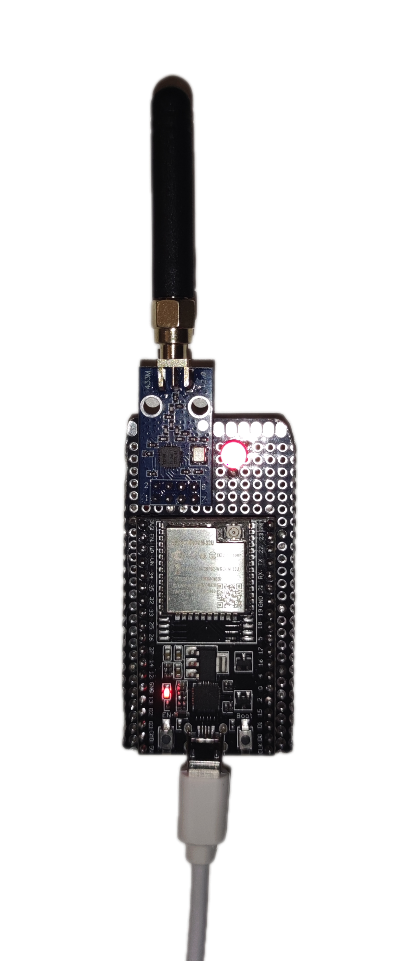
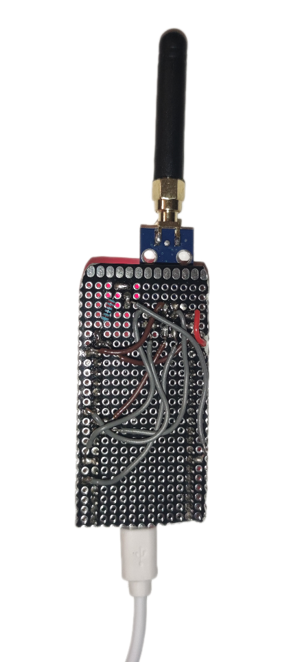

# Jammer-433MHZ-ESP32
## Aim
The aim of this project is to design a 433MHz rf jammer using the CC1101 module and the ESP32 (ESP32-WROOM-32u here).

---

## Finished Pcb result

## What you need

### Mandatory

- (1x) ESP32-WROOM-32U (or other esp) 

- (1x) CC1101 433mhz module + antenna 

### Optional

- (1x) Led 

- (1x) 220Ω (ohm) resistor 

- (1x) Prototype PCB 

---
## Wiring

### Pinout and wiring of the CC1101 module to the ESP32

| Pin No. | Item        | Pin ESP32       | Direction | Description                                                        |
|---------|-------------|-----------------|-----------|--------------------------------------------------------------------|
| 1       | GND         | GND             |           | Ground                                                            |
| 2       | VCC         | 3.3V            |           | Power supply, 1.8V - 3.6V                                          |
| 3       | GDO0        | GPIO2 (Pin 2)   | Output    | Data output pin                                                   |
| 4       | CSN         | GPIO5 (Pin 5)   | Input     | Module chip selection pin for starting SPI communication          |
| 5       | SCK         | GPIO18 (Pin 18) | Input     | SPI clock pin                                                     |
| 6       | MOSI        | GPIO23 (Pin 23) | Input     | SPI data input pin                                                |
| 7       | MISO/GDO1   | GPIO19 (Pin 19) | Output    | SPI data output pin                                               |
| 8       | GDO2        | GPIO4 (Pin 4)   | Output    | Data output pin                                                   |

### Optional wiring (Led)

| Pin No.       | Item          | Pin ESP32       | Direction | Description                                      |
|---------------|---------------|-----------------|-----------|--------------------------------------------------|
| Anode (+)     |         | GPIO12 (Pin 12) | Output    | Connect the anode of the LED directly to GPIO12 |
| Cathode (-)   | Resistor 220Ω (ohm) | GND             |           | Connect the cathode of the LED to GND via a 220Ω (ohm) resistor |

---

## Power supply

The device needs (best) an external battery to power it or a 5V supply. A possible improvement would be to add a lipo battery (requires a voltage booster and a charge regulator).

## Usage

Just click on the esp32 "boot" button to pause (the LED should go out), then click again to restart.

## How to compile the project

Libraries required :
- SmartRC-CC1101-Driver-Lib by LSatan
- ezButton by ArduinoGetStarted

Then you can simply choose the code that suits you and compile it in an arduino IDE. (You'll probably need a board manager like esp32 by Espressif Systems to detect your esp)

## Wiring on pcb

